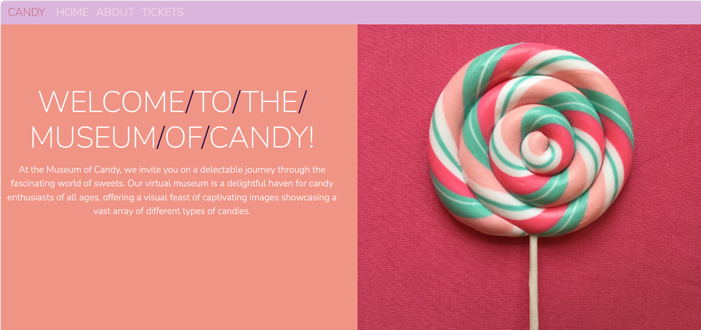

# 🍭 Museum of Candy

Welcome to the **Museum of Candy**, a vibrant and responsive landing page designed to celebrate the sweet and colorful world of confectionery. This project showcases modern web design techniques using Bootstrap and custom CSS to create a delightful user experience.

## Key Features

- **Scroll-Responsive Navbar**: Uses jQuery to toggle background transparency, providing a premium, modern feel.
- **Alternating Grid Layout**: A clean, "checkerboard" style layout built with Bootstrap 4 utility classes.
- **Typography-First Design**: Integrated Google Fonts (Nunito) for a playful yet professional aesthetic.
- **Mobile-First**: Fully responsive across all breakpoints using Bootstrap's grid system.

## Preview

 
   

*The layout features a series of alternating "blurbs" and images highlighting different aspects of the candy world.*

## Quick Start

1. Clone the repository.
2. Open `index.html` in any modern browser.

## Built With

- **Bootstrap 4** (Layout & Components)
- **jQuery** (Scroll Events)
- **Custom CSS3** (Transitions & Color Palette)

---

*Made with ❤️ for candy lovers everywhere.*
